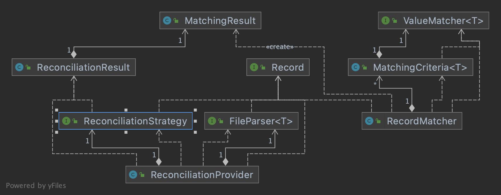

# Business
## General
 - Reconciliation is a process to find matching records between 2 sources with a matching strategy to see the differences between
 record in different system. in the end of process, the output will be a list of matching records, unmatched record. 
 Sometimes the process can also produce suggested records which can be used for manually matching. 
 - This project is focusing on transaction reconciliation, however the implementation is generic enough for other type of reconciliation 
 as long as it follows the configuration provided
 - Currently, this project only supports one to one matching process
## Terminologies
 - *Pass rule*: a rule which is used to check against records to see if they are matched. It contains a list of *matching criteria* base on column names.
 - *Matching Criteria*: a configuration to for comparing value of a column in a record against the other record's column.
 - *Matching percentage*: to indicate how many percent the 2 records matched, this number compute base on a pass rule
## Process flow
 1. Parse 2 source file into records
 2. Use strategy for finding matching, unmatched, and suggested records. Currently, 2 strategy are available:
    2.1 Use index column strategy: create an index (multi value map) for one source for searching, 
    and walk through each record in the other source, search against the index, then compute matching 
    2.2 Use exhaustion strategy: walk through each record in one source and find matching record in the other source
 3. Return list of matching result. Each of matching result will contain 2 record of two source and a matching percentage
    - 100% is perfect match
    - 0% is unmatched
    - in between 0 and 100 is suggested
# Technical
## Technologies
- SpringBoot
- JUnit for TDD
- Cucumber for BDD
- Lombok for code auto generation
- OpenCsv for file process
## Project structure
- This project follow SpringBoot standard project structure
- `reconciliation` is an independent submodule exposing API for processing reconciliation.
It was implemented to have boundary in itself from the parent module, this helps to reduce migration effort to a library later
- 

## Configuration
- To configure matching pass rule and index, the `reconciliation` module provides Interface for creating object for these configurations, 
see `com.tutuka.txmanagement.configuration.ReconciliationProviderConfiguration` for example.

## Build and Run
 1. Run `mvn clean package` to build project
 2. Run `mvn spring-boot:run` to start
